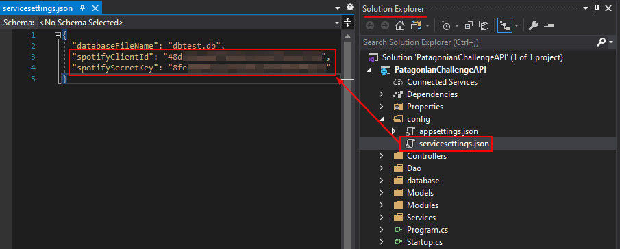
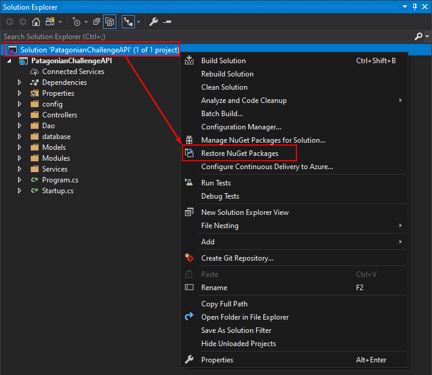
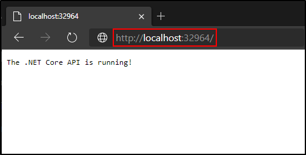
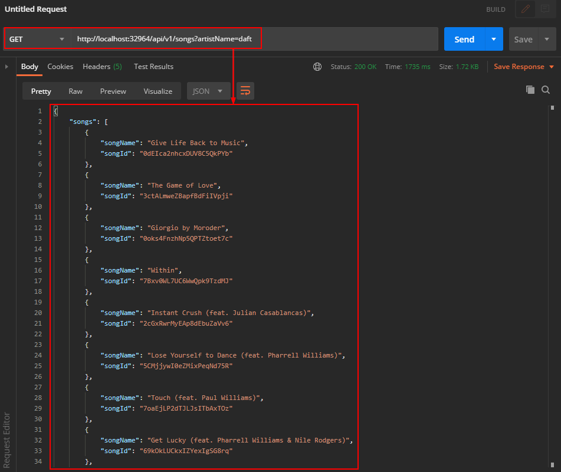
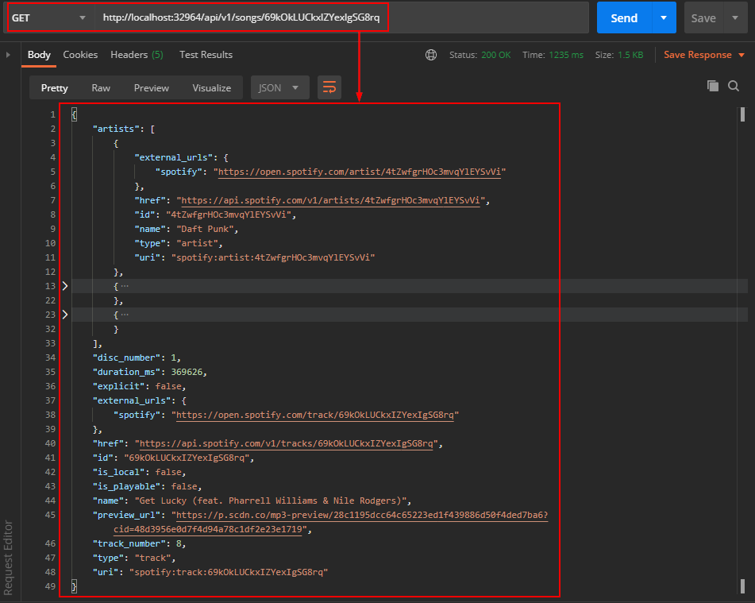

# .NET Core Patagonian Challenge API

## Overview

This .NET Core project is an API that has two endpoints. One of them retrieves information from a SQLite database and the other one retrieves information from the Spotify's public API. You will find more information on the API specification.

## Pre-requisites

- Database populated (run the script to populate the database, see more information [here](../script/README.md))
- Visual Studio (find the latest version [here](https://visualstudio.microsoft.com/downloads/))
- .NET Core 3.1 SDK (find it [here](https://dotnet.microsoft.com/download/dotnet-core/3.1))
- Registered Spotify Application
  - You will need the Client ID and the Secret Key to access to the Spotify's API. You will find more information on how to register your app on the [Spotify documentation](https://developer.spotify.com/documentation/general/guides/app-settings/#register-your-app)
- Postman or any other client API of your preference (find the latest version [here](https://www.postman.com/downloads/))

## Running the API

### Step 1

Open the solution with Visual Studio. Then, store your Spotify credentials (Spotify Client Id & Spotify Secret Key) into the `servicesettings.json` file located at the `config` folder in the `Solution Explorer`.

### Step 2

Right click on the Solution and restore NuGet packages.

### Step 3

After that, start the API with Visual Studio pressing `F5`, your default browser will be opened with the URL of the API.  If you're using Google Chrome, ensure that the URL is using HTTP instead HTTPS.

The API is running!

### Step 4

Open Postman and start requesting to the endpoints. If you need more information about the endpoints, refer to the API specification.

#### /api/v1/songs endpoint

#### /api/v1/song/{songId} endpoint

