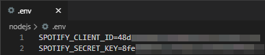
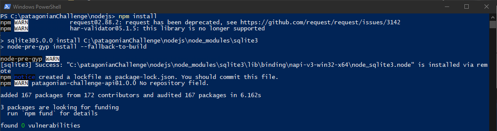
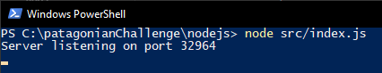
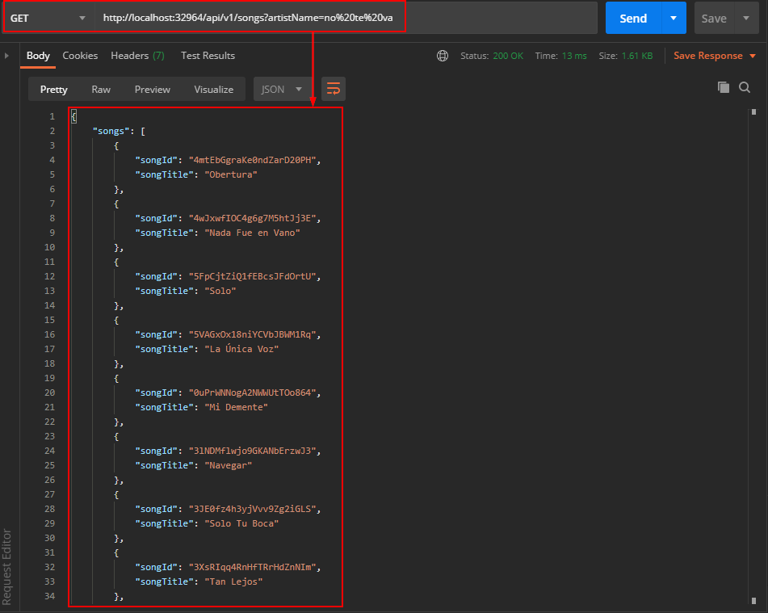
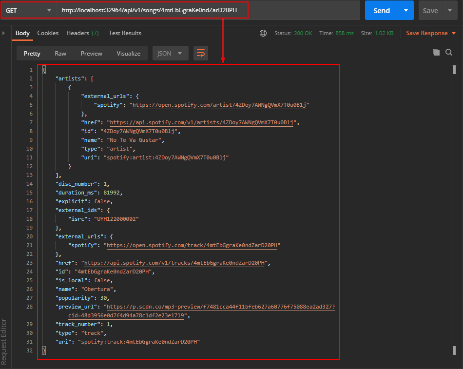

# Nodejs Patagonian Challenge API

## Overview

This Nodejs project is an API that has two endpoints. One of them retrieves information from a SQLite database and the other one retrieves information from the Spotify's public API. You will find more information on the API specification.

## Pre-requisites

- Database populated (run the script to populate the database, see more information [here](../script/README.md))
- Nodejs (find the latest version [here](https://nodejs.org/en/download/))
- Registered Spotify Application
  - You will need the Client ID and the Secret Key to access to the Spotify's API. You will find more information on how to register your app on the [Spotify documentation](https://developer.spotify.com/documentation/general/guides/app-settings/#register-your-app)
- Postman or any other client API of your preference (find the latest version [here](https://www.postman.com/downloads/))

## Running the API

### Step 1

First of all, you need to store your Spotify credentials (Spotify Client Id & Spotify Secret Key) into the .env file located at the `nodejs` folder.

### Step 2

Open a Powershell window (or Terminal if you're running on MacOS or Linux bash) within `nodejs` directory and install node packages using `npm install`.

### Step 3

After that, start the API with node:

`node src/index.js`

The API is running!

### Step 4

Open Postman and start requesting to the endpoints. If you need more information about the endpoints, refer to the API specification.

#### /api/v1/songs endpoint

#### /api/v1/songs/{songId} endpoint

