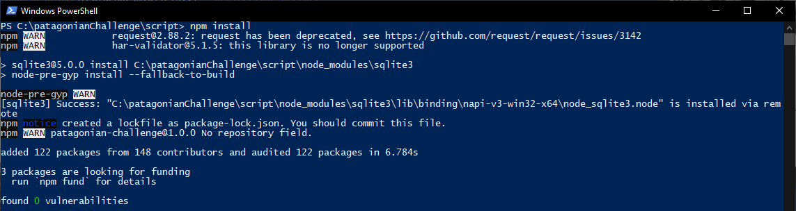
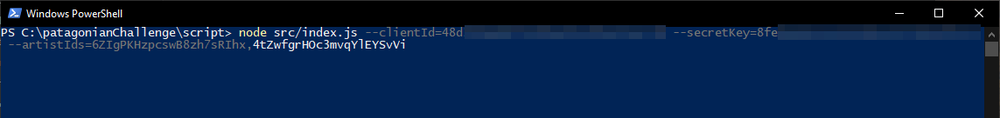
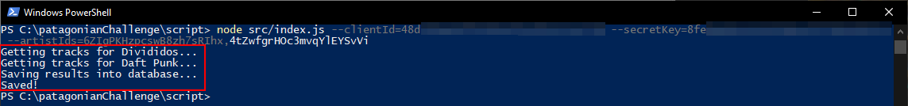
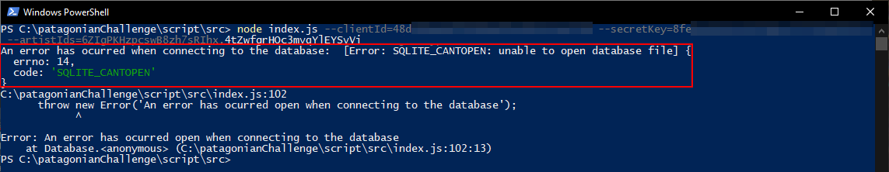

# Script

## Overview
This script creates and populates the database used by each API project. It uses the Spotify's public API to get the information.

## Pre-requisites

- Nodejs (find the latest version [here](https://nodejs.org/en/download/))
- Registered Spotify Application
  - You will need the Client ID and the Secret Key to access to the Spotify's API. You will find more information on how to register your app on the [Spotify documentation](https://developer.spotify.com/documentation/general/guides/app-settings/#register-your-app)

## Script parameters

- --clientId
  - Specifies the Spotify's Client ID application
- --secretKey
  - Specifies the Spotify's Secret Key application
- --artistIds
  - Specifies the Artist IDs used by the script to populate the database. It is a comma separated value

## How to populate the database
### Step 1
First of all, you need to restore the npm packages. Open a Powershell window (or Terminal if you're running on MacOS or Linux bash) within `script` directory and run the `npm install` command.

### Step 2
Run the script with node:

`node src/index.js --clientId=<YOUR_SPOTIFY_CLIENT_ID> --secretKey=<YOUR_SPOTIFY_SECRET_KEY> --artistIds=<ARTIST_ID1[,ARTIST_ID2]>`

After a while, you will see the following output

The database has been populated.

**_NOTE: Every time you run the script, it will override all the existent information._**

## Troubleshooting
### SQLITE_CANTOPEN

If you get a SQLITE_CANTOPEN error, probably you're running the script from the `src` directory. To fix it, simply go back to the `script` directory (`cd ..` command) an run the script from there.
